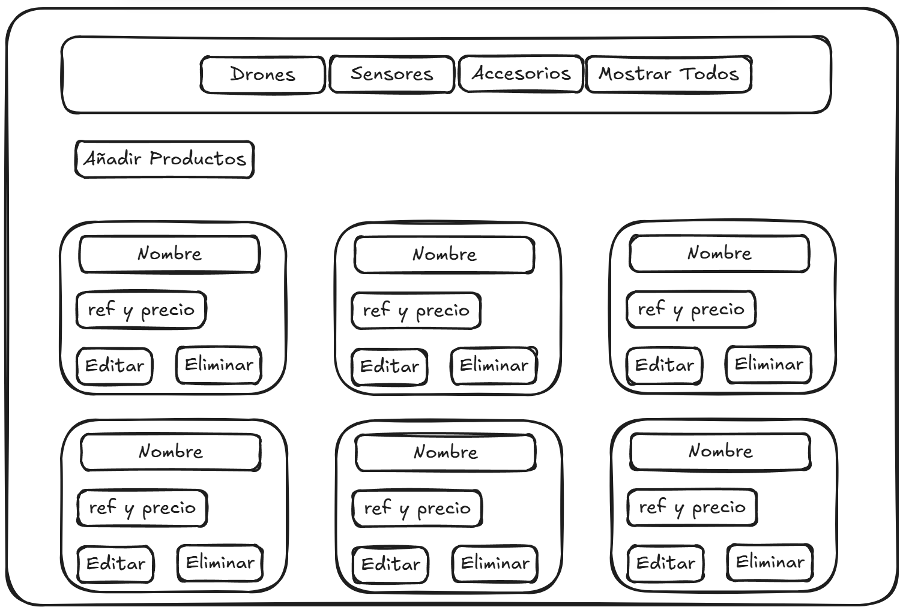
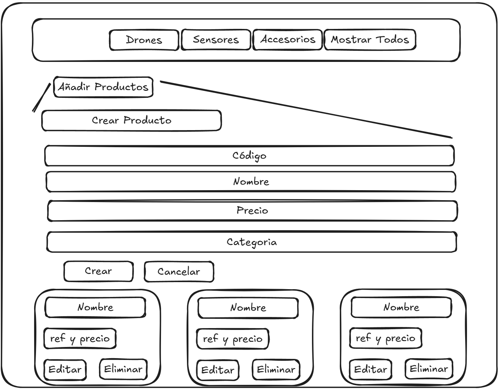
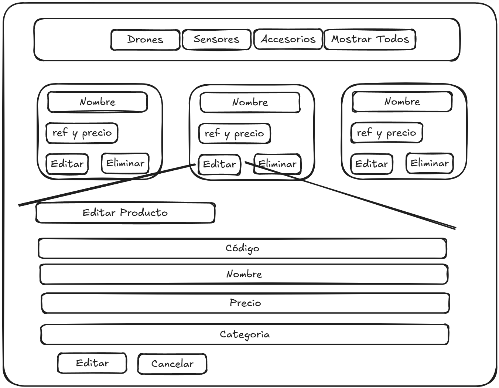

# Proyecto de CRUD - Gestión de Productos

Este proyecto es una aplicación web para la gestión de productos desarrollada con **AngularJS** y **Bootstrap** en el frontend y **PHP** en el backend. La arquitectura sigue el modelo **MC** (Modelo-Controlador) para el backend, y el frontend organiza las funcionalidades en módulos y componentes.

## Despliegue del Proyecto

### Instalación

1. **Clonar el repositorio:**

   ```bash
   git clone https://github.com/SantMu123/CRUDProductos.git
   cd CRUDProductos
   ```

2. **Descargar dependencias:**

   ```bash
   npm install
   ```

3. **Iniciar la base de datos**

   Se usó railway como servidor para la base de datos, las variables de la cadena de conexión se especifican en el archivo .env, sin embargo, tambien se puede iniciar de forma local con el archivo **db.sql**

   Opcion 1 Railway:

   Pegar lo siguiente en el archivo .env en la raiz del proyecto

   ```bash
      DB_HOST=junction.proxy.rlwy.net
      DB_PORT=11649
      DB_USER=root
      DB_PASSWORD=uJtjdeMkDtbQyNZbOSNVWmUmaHxDSXXi
      DB_NAME=Tecnologia
      DB_CHARSET=utf8
   ```

   Opcion 2 (Forma local):

   ```bash
      DB_HOST=localhost
      DB_PORT=3306
      DB_USER=root
      DB_PASSWORD= (puedes dejarlo vacío si no tienes contraseña para el usuario root)
      DB_NAME=Tecnologia
      DB_CHARSET=utf8mb4
   ```

   Para la opción dos, una vez definidas las variables de entorno se ejecuta el siguiente comando estando en la raiz del proyecto

   ```bash
   mysql -u root -p Tecnologia < db.sql
   ```


4. **Ejecutar la aplicación:**

   ```bash
   npm run dev
   ```

   Esto ejecutará:
   - El **backend en PHP** en el puerto `3600`.
   - El **frontend en AngularJS** en el puerto `8000`.

5. **IMPORTANTE**

Una vez iniciado el servidor en el puerto 8000, navega a index.html para ver la interfaz de gestión de productos y categorías:

   ```bash
   http://localhost:8000/index.html#!/

   ```

### Configuración de Puertos

- **Cambiar puerto del frontend:** Modificar en el archivo `app/package.json`.
- **Cambiar puerto del backend:** Modificar en los archivos `app/services/productService.js` y `package.json`.

## Estructura del Proyecto

### Backend (PHP)

El backend sigue una arquitectura **MC** (Modelo - Controlador) y se conecta a la base de datos. La base de datos se despliega en **Railway** y los comandos usados para la creación de la base de datos están situados en el archivo **db.sql**.

# Solución a parte 2 de la prueba

La solución se encuentra en el archivo **consultasParte2.txt**

### Layouts

A continuación adjunto los layouts de la etapa de planeación en donde se detalla la interfaz de productos, despliegue de creación y edicion de productos.

En el primer layout se observa la disposición de las categorias en el header y los productos usando un grid de tres columnas, cada producto va estar en una componente "card" mostrandose los productos por categoria:



En el segundo layout se observa la disposición del formulario para crea un nuevo producto, este formulario se despliega luego de darle al boton de "Crear Producto"



En el tercer layout se observa la disposicion del formulario para la edicion del producto, **Este formulario se despliega en la parte final de la pantalla** y se despliega luego de darle editar a cualquier producto



- **Santiago Muñoz Castañeda** - _Autor_

